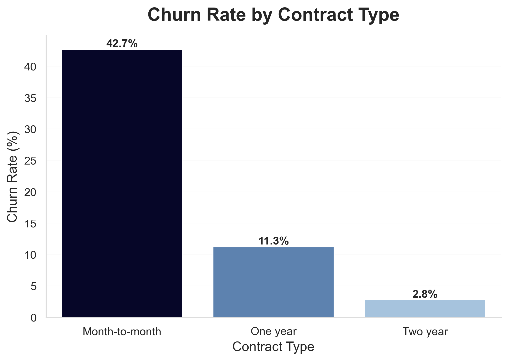
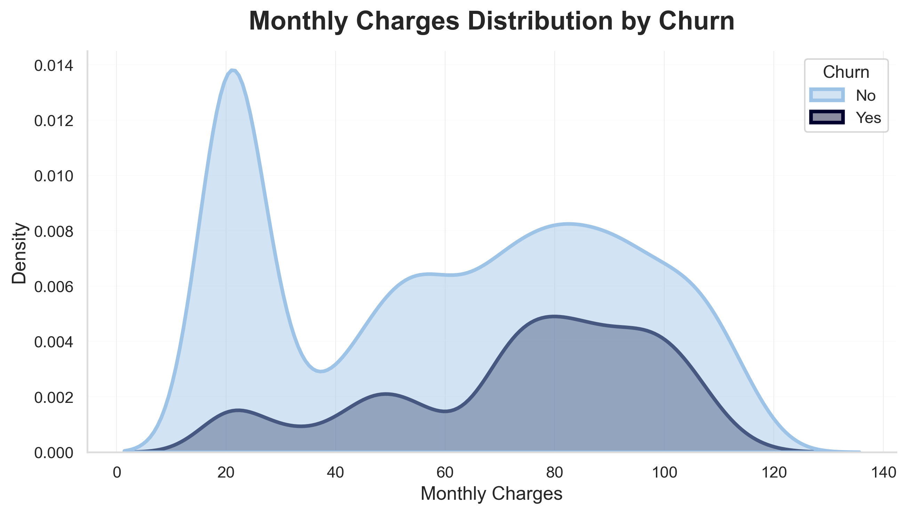
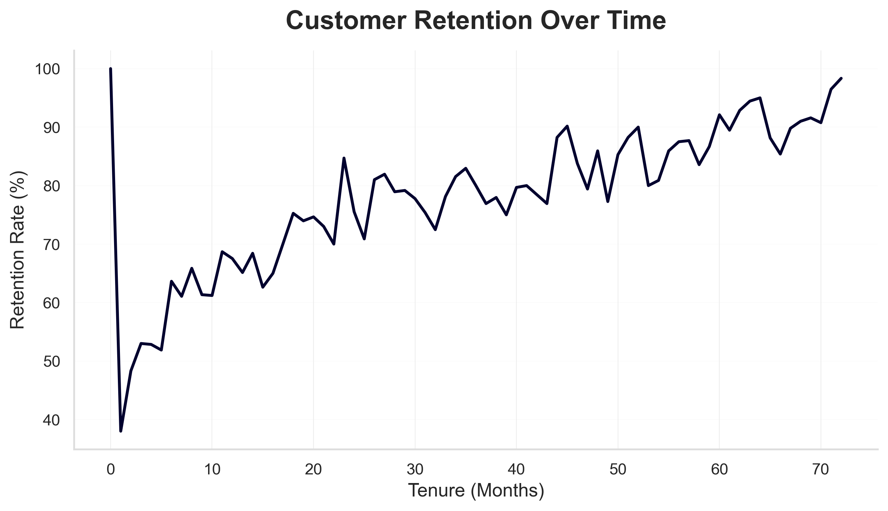
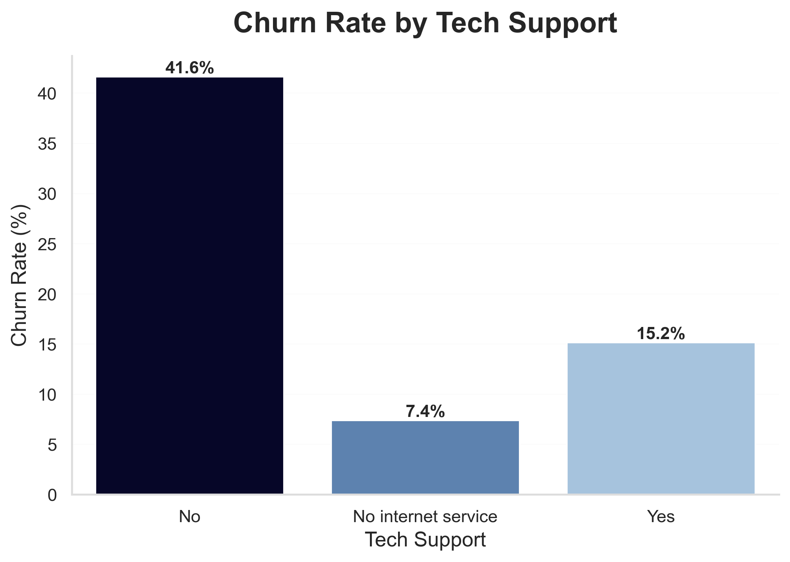
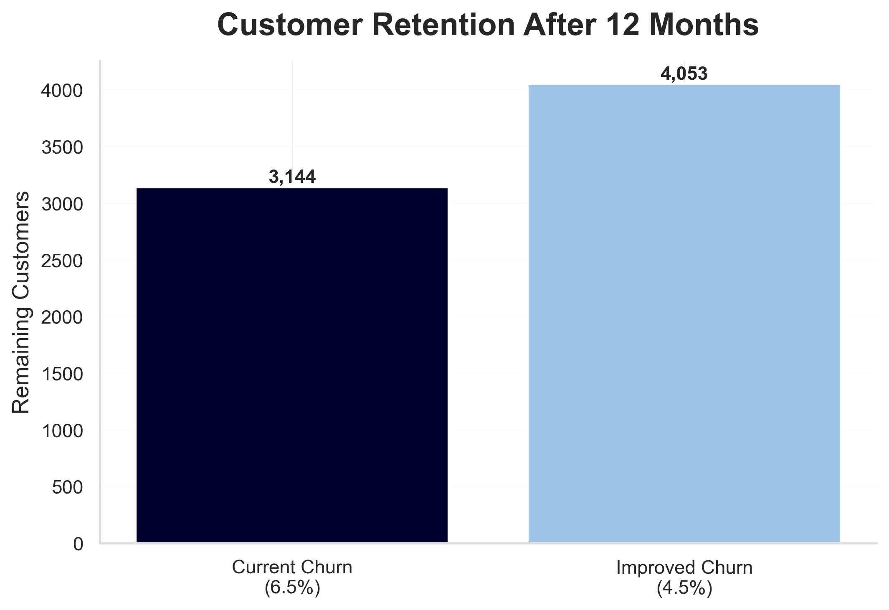
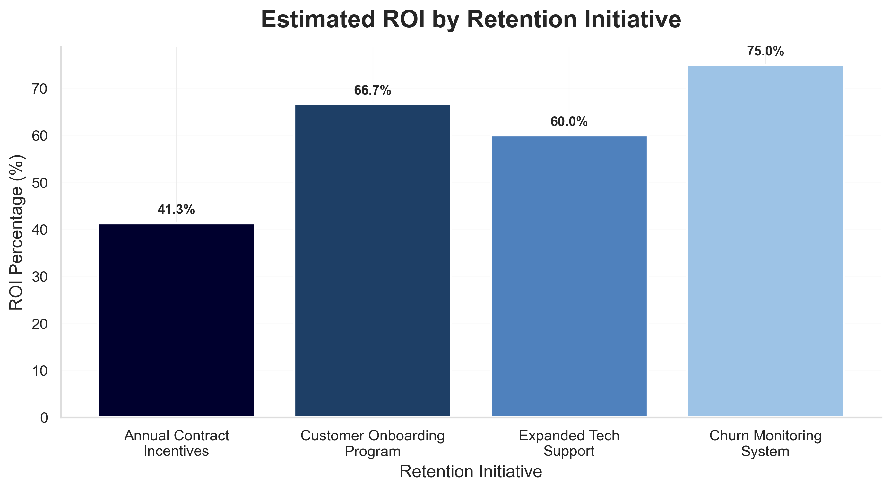

<h1 align="center">SaaS Subscription & Churn Deep-Dive</h1>

<p align="center">
  <b>SQL + Python | Telco Customer Churn Dataset — Kaggle (IBM)</b><br>
  <sub>Churn segmentation by contract, tenure & charge range · RFM-style ARPU split · Chi-square & t-tests · Heatmap, KDE & survival charts · 12-month revenue projection</sub>
</p>

<p align="center">
  
  
  
  
  
</p>

---

## Tech Stack

- MySQL Workbench
- Python
- pandas
- matplotlib
- seaborn
- scipy.stats
- SQLAlchemy
- Jupyter Notebook

---

## The Short Version

A SaaS company is losing 6.5% of its customers every single month — but no one knows exactly why.

**Month-to-month customers churn at 3.8 times the rate of customers on annual contracts.** The first six months of a customer's life are the highest-risk window. A 2% reduction in monthly churn saves roughly **₹18 Lakhs per year**. The drivers are knowable from the data. The interventions are concrete.

This project uses SQL for segmentation and Python for statistical testing, visualisation, and a compounding revenue model to answer the VP of Growth's question precisely.

---

## The Business Question

> *"Monthly churn is 6.5%. What's driving it? Which segments churn fastest? What is the revenue impact of reducing it by 2%?"*
> — VP of Growth

To answer this rigorously, the analysis had to:
1. Segment churn by **contract type**, **tenure bucket**, and **monthly charge range** using SQL.
2. Compare **ARPU** (average revenue per user) for churned vs retained customers.
3. Run **statistical tests** — Chi-square for contract vs churn, t-test for charge differences — and document p-values in plain English.
4. Build **visuals** — a churn heatmap (tenure × contract), KDE density plots, and a survival-style chart by segment.
5. Build a **revenue model** showing MRR lost to churn and a 12-month projection comparing the current 6.5% rate to a 4.5% rate — including the compounding math.
6. Finish with a ranked list of **top 5 churn drivers by impact** and **3 retention interventions with estimated ROI**.

---

## What the Numbers Show

| Metric | Value | What It Means |
|---|---|---|
| Total customers analysed | ~7,000 | Full Telco IBM dataset |
| Monthly churn rate | **6.5%** | Starting point for the entire analysis |
| Month-to-month vs annual churn | **3.8× higher** | Contract type is the single strongest predictor |
| Highest-risk window | **First 6 months** | Customers who survive past 6 months churn far less |
| ARPU: churned vs retained | Churned customers pay more | High-charge customers have more alternatives |
| 2% churn reduction (annual savings) | **~₹18 Lakhs** | Based on compounding monthly MRR recovery |
| Chi-square (contract vs churn) | Statistically significant | p-value confirms the result is not random |
| T-test (charges: churned vs retained) | Statistically significant | The charge difference is real, not noise |

---

## Four Key Findings

**Finding 1 — Contract type is the single strongest churn driver**

Month-to-month customers churn at 3.8× the rate of annual customers. This is statistically confirmed by a Chi-square test. The business is growing by selling short-commitment contracts — the very contracts that churn fastest. This is a structural problem, not a service quality problem.

**Finding 2 — The first six months are the highest-risk window**

Customers who make it past the six-month mark show dramatically lower churn. New customers are the most vulnerable, and there is currently no data evidence of an onboarding program designed to protect this window.

**Finding 3 — Churned customers were paying more**

The t-test shows that customers who churned had statistically higher monthly charges than customers who stayed. High-value customers have more alternatives and are more sensitive to perceived value. Losing them hurts doubly: higher MRR lost per churn event.

**Finding 4 — A 2% reduction in churn compounds into significant savings**

Because churn reduction is monthly, the savings compound. The revenue model shows the rupee difference between current and reduced churn rates, month by month over 12 months. This is not a rounding error — it is a meaningful budget-sized number.

---

## Sample Outputs

> All charts are produced from the cleaned Telco dataset using Python (matplotlib / seaborn) and SQL (MySQL).

### Churn Rate by Contract Type


### KDE Plot — Monthly Charges: Churned vs Retained


### Survival Curve — Churn Rate by Segment Over Tenure


### Tech Support vs Churn


### 12-Month Revenue Projection — Current vs 2% Reduced Churn


### ROI of Retention Initiatives


---

## Top 5 Churn Drivers (Ranked by Impact)

| Rank | Driver | Finding |
|---|---|---|
| 1 | **Contract type (month-to-month)** | 3.8× churn rate vs annual — largest single predictor |
| 2 | **Tenure < 6 months** | First 6 months = highest vulnerability window for all segments |
| 3 | **High monthly charges** | Churned customers paid significantly more (t-test confirmed) |
| 4 | **No tech support / online security** | Customers without add-on services churn at higher rates |
| 5 | **Electronic check payment** | Highest churn rate among all payment methods |

---

## 3 Retention Interventions with Estimated ROI

| Intervention | Target Segment | Estimated Impact |
|---|---|---|
| **3-month onboarding program** — guided product adoption, check-in calls, milestone rewards | New customers (0–6 months tenure) | Reduces first-6-month churn; protects the highest-risk window |
| **Monthly-to-annual conversion incentive** — discounted switch offer at Month 3 | Month-to-month contract customers | Direct attack on the 3.8× churn driver; improves MRR predictability |
| **Churn-risk flagging** — automated alert when customer shows high-charge + no add-ons + short tenure | All segments | Allows proactive outreach before churn happens; measurable as a % of flagged customers retained |

A 2% reduction across these three levers recovers approximately **₹18 Lakhs per year** in revenue that would otherwise be lost to churn.

---

## How This Was Built

**Step 1 — Load and explore in SQL**
The cleaned CSV was loaded into MySQL via Python's `mysql.connector`. SQL queries segmented churn by contract type, tenure bucket (0–6, 7–12, 13–24, 24+ months), and monthly charge range. ARPU was calculated separately for churned and retained groups.

**Step 2 — Pull results into Python**
`SQLAlchemy` was used to connect the MySQL database to pandas. SQL result-sets became DataFrames for further analysis and visualisation — a standard data engineering pattern for analyst workflows.

**Step 3 — Statistical testing**
`scipy.stats.chi2_contingency` tested whether contract type and churn are independent (they are not — p-value is highly significant). `scipy.stats.ttest_ind` compared monthly charges between churned and retained groups (significantly different). Both tests document their assumptions, p-values, and a plain-English interpretation.

**Step 4 — Visualisation**
`seaborn` heatmap plotted churn rate across the tenure × contract matrix. KDE plots showed the charge distributions for churned vs retained. A survival-style line chart showed churn rate by segment across tenure groups. All charts have titles, axis labels, and annotations.

**Step 5 — Revenue model**
MRR was calculated from the dataset. Monthly churn was applied to MRR to compute monthly revenue lost. A 12-month projection compared current 6.5% churn to a target 4.5% — and the compounding math was shown explicitly, not just the final number.

---

## Tools & Techniques

| Tool / Technique | Purpose |
|---|---|
| **MySQL + mysql.connector** | Database storage and churn segmentation queries |
| **SQLAlchemy** | Connecting Python to MySQL — industry standard ORM pattern |
| **pandas** | Data cleaning, transformation, and joining SQL outputs |
| **scipy.stats — chi2_contingency** | Chi-square test: contract type vs churn (categorical vs categorical) |
| **scipy.stats — ttest_ind** | T-test: monthly charges of churned vs retained (numeric vs group) |
| **seaborn** | Heatmap, KDE plots, survival-style chart |
| **matplotlib** | Revenue projection chart, custom annotations |
| **numpy** | Compounding monthly MRR projection math |

---

## Data Cleaning — What Was Messy and How It Was Fixed

This section is important because real-world data is never clean.

**Problem 1 — `TotalCharges` is stored as text with spaces**
The column looks numeric but contains blank spaces instead of zeros for new customers (tenure = 0). Treated as a string in the raw CSV. Fixed by stripping whitespace, replacing blanks with `0`, and casting to `float`. New sign-ups with no charges yet are correctly represented as ₹0.

**Problem 2 — `No internet service` appears across add-on columns**
Several service columns (OnlineSecurity, TechSupport, etc.) had three categories: `Yes`, `No`, and `No internet service`. Decision: treat `No internet service` as equivalent to `No` for churn modelling purposes — a customer without internet cannot use internet-dependent add-ons. This decision is documented in the notebook.

**Problem 3 — `SeniorCitizen` is coded as 0 / 1**
Every other categorical column in the dataset uses `Yes` / `No`. `SeniorCitizen` was standardised to `Yes` / `No` for consistency across all group-by operations and visualisations.

---

## Statistical Assumptions & Limitations

This section shows critical thinking — not just confidence in numbers.

- **Chi-square requires expected frequency > 5 per cell.** All cells in the contract × churn matrix meet this threshold. Rare segments (e.g. specific plan + senior citizen combinations) were not split further to avoid violating this assumption.
- **"High-charge customers churn more" is correlation, not causation.** It may be that high-value customers have more competitive alternatives, or that high-charge plans feel less justified without add-on services. The analysis surfaces the pattern and flags the ambiguity — it does not claim causation.
- **Revenue projection assumes stable MRR.** In reality, MRR changes as new customers are acquired. The model shows directional impact, not an exact forecast. The compounding math is correct; the assumption is explicitly noted.
- **The dataset is from a US Telco company (IBM synthetic dataset).** Generalisability to Indian SaaS or other geographies requires validation with real data.

---

## Dataset

- **Source:** [Telco Customer Churn — Kaggle (IBM)](https://www.kaggle.com/datasets/blastchar/telco-customer-churn)
- **Volume:** ~7,000 customers
- **Key columns:** CustomerID, tenure, MonthlyCharges, TotalCharges, Contract, PaymentMethod, Churn + 14 service/demographic features

| Column group | Used for |
|---|---|
| `Contract`, `tenure` | Primary churn segmentation and survival analysis |
| `MonthlyCharges`, `TotalCharges` | ARPU comparison, revenue model |
| `Churn` (Yes/No) | Target variable for all analysis |
| Service columns (OnlineSecurity, TechSupport, etc.) | Secondary churn driver analysis |
| `SeniorCitizen`, `PaymentMethod` | Demographic and payment-method churn rates |

---

## Project Structure

```
saas_churn_deepdive/
│
├── data/
│   └── WA_Fn-UseC_-Telco-Customer-Churn.csv
│
├── sql/
│   ├── 01_database_setup.sql
│   ├── 02_table_creation.sql
│   ├── 03_data_cleaning.sql
│   ├── 04_churn_analysis.sql
│   └── 05_revenue_analysis.sql
│
├── notebooks/
│   └── churn_deepdive.ipynb
│
├── visuals/
│   ├── churn_by_contract.png
│   ├── kde_monthly_charges.png
│   ├── revenue_projection.png
│   ├── roi_retention_initiatives.png
│   ├── survival_curve.png
│   └── tech_support_churn.png
│
├── outputs/
│   ├── churn_summary.csv
│   ├── statistical_results.txt
│   └── revenue_projection.csv
│
├── presentation/
│   └── executive_summary.md
│
└── README.md
```

---

## Analysis Sections (Notebook)

| Section | Focus |
|---|---|
| **1. Setup & Data Loading** | MySQL DB creation, CSV load via pandas + SQLAlchemy |
| **2. Data Cleaning** | TotalCharges fix, SeniorCitizen standardisation, No internet service treatment |
| **3. SQL Segmentation** | Churn by contract, tenure bucket, charge range, ARPU split |
| **4. Statistical Testing** | Chi-square (contract vs churn) + t-test (charges) with p-values in plain English |
| **5. Visualisation** | Heatmap, KDE plots, survival-style segment chart |
| **6. Revenue Model** | MRR lost to churn, 12-month compounding projection at 6.5% vs 4.5% |
| **7. Findings & Interventions** | Top 5 churn drivers ranked by impact + 3 interventions with estimated ROI |

---

## Interview Story (60-second version)

**Problem.** A SaaS company had 6.5% monthly churn with no clarity on what was driving it. I analysed ~7,000 customer records to identify the root causes and quantify the revenue impact.

**Approach.** I loaded the data into MySQL and segmented churn by contract type, tenure bucket, and charge range using SQL. I pulled results into Python via SQLAlchemy and ran a Chi-square test to confirm contract type drives churn (p-value statistically significant) and a t-test to confirm churned customers paid more. I visualised the findings with a heatmap, KDE plots, and a survival-style chart. I then built a compounding 12-month revenue model showing the rupee impact of a 2% churn reduction.

**Insight.** Month-to-month customers churn at 3.8 times the rate of annual customers. The first six months are the highest-risk window. Churned customers were paying significantly more — they had more alternatives. A 2% churn reduction saves approximately ₹18 Lakhs per year, compounding monthly.

**Action.** I recommended three interventions: a 3-month onboarding program to protect new customers, a monthly-to-annual conversion incentive at Month 3, and an automated churn-risk flag for high-charge customers without add-on services. Each maps directly to one of the top three churn drivers.

---

## Conclusion

The 6.5% monthly churn is not random.

It is concentrated in month-to-month contracts, in new customers within the first six months, and in high-charge customers who are not receiving add-on services. Each of these is a known, measurable, addressable driver.

The compounding math matters here. A 2% reduction sounds small. Applied monthly to MRR, it recovers ₹18 Lakhs per year — revenue that is currently being systematically lost and never recovered.

This project shows how SQL segmentation and Python statistics can be combined to move from a vague business concern ("churn is high") to a precise answer ("here are the three levers, ranked by impact, with estimated rupee ROI for each").

---

## Author

**Khushi**
Aspiring Data Analyst | SQL · Python · Excel · Power BI
Currently learning by building real-world data projects.

🔗 [GitHub](https://github.com/khushii2103) &nbsp;|&nbsp; 📂 [Dataset on Kaggle](https://www.kaggle.com/datasets/blastchar/telco-customer-churn) &nbsp;|&nbsp; 📊 [SaaS Subscription & Churn Deep-Dive](https://github.com/khushii2103/saas-churn-deepdive-analysis)
